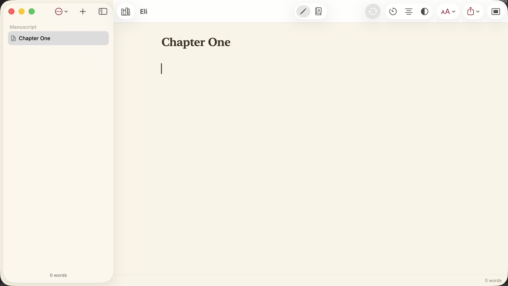

# Eli

A free, beautiful, distraction-free book-writing app for macOS. Native SwiftUI. Open source.

> Feel like Ulysses, organize like Scrivener (minus the cockpit), be free and truly Mac-native —
> and do something none of them do: **chapter-by-chapter literary translation.**

<p align="center">
  
</p>

## Why Eli exists

The good writing apps (Ulysses, iA Writer) are beautiful but paid/subscription and Apple-locked.
The free ones (bibisco, Quoll Writer, Manuskript) are feature-rich but visibly unpolished and
non-native. **No one occupies "beautiful + free + native."** Eli does — and it's **writing-first,
not outline-first**: you write immediately. Structure is optional scaffolding, never a gate.

## Features

- **Distraction-free editor** — typewriter mode, focus mode (dim everything but the current
  paragraph), compose mode (⌘⇧↩ hides the sidebar), comfortable typography and paragraph spacing.
- **Beautiful themes & accents** — Light, Cream, Dark, System; eight accent colors.
- **Chapters & optional scenes** — add scenes to a chapter only if you want; plain chapters stay
  simple. Draft / Revising / Done status per section.
- **Markdown formatting** — ⌘B / ⌘I, `#` headings; renders properly in every export.
- **Literary translation** — translate Tagalog → English (or any pair) chapter by chapter with a
  cloud LLM, a glossary (with per-character gender), and a review step so re-translating never
  destroys your edits. Bring your own free API key (stored in the Keychain).
- **Goals & momentum** — word-count goal with progress, "words today," writing sprints, and a
  gentle "X of the last 30 days" streak.
- **Export** — PDF (print-ready 6×9), EPUB, Word (.docx), RTF, Markdown, plain text.
- **Automatic backups** — compressed, capped, and one-click restore to any earlier version.
- **Whole-book search** and find & replace.
- **One-click updates** — the toolbar button lights up when a new version is published.

## Platform

- **macOS 13 Ventura and up.** 100% native SwiftUI + AppKit — no Electron, no web view.

## Build from source

```sh
brew install xcodegen
xcodegen generate
open Eli.xcodeproj   # then ⌘R in Xcode
```

The project is generated from `project.yml` (the `.xcodeproj` is git-ignored). The document format
is a `.eli` package: per-chapter Markdown + JSON, inspectable and git-friendly.

## Translation setup

Eli uses Google Gemini by default. On first launch, paste a free
[Google AI Studio](https://aistudio.google.com/apikey) key — it's stored privately in your
Keychain, never in your book or the app.

## Docs

- [docs/SPEC.md](docs/SPEC.md) — product & technical spec
- [docs/ROADMAP.md](docs/ROADMAP.md) — build plan
- [docs/SHIPPING.md](docs/SHIPPING.md) — signing, notarization, and turning on auto-updates
- [docs/research/](docs/research/) — the competitor & translation research behind the design

## License

MIT — © 2026 Hatim El Hassak.
