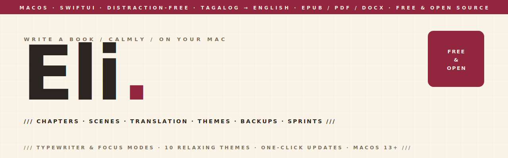

<p align="center">
  <picture>
    <source media="(prefers-color-scheme: dark)" srcset="assets-readme/hero-banner-dark.svg" />
    
  </picture>
</p>

<p align="center">
  
  
  
  
  
  
</p>

<p align="center">
  <em>Eli is a free, beautiful, distraction-free book-writing app for macOS. It feels like Ulysses, organizes like Scrivener without the cockpit, and does one thing none of them do — translate your manuscript chapter by chapter into polished, literary English. Native SwiftUI, no Electron, no subscription. It keeps your books for you (no files to hunt down), backs them up automatically, and updates with one click. Built first for one writer working in Tagalog; free for every writer.</em>
</p>

<p align="center">
  
</p>

---

### `/// WHAT IT IS`

```
┌──────────────────────────────────────────────────────────────────┐
│ YOUR BOOKS (library)                                               │
│ ▸ A shelf of every book — open, create, delete. No file picker.    │
├───────────────────────┬──────────────────────────────────────────┤
│ BINDER                │ WRITE                                      │
│ ▸ Chapters            │ ▸ Distraction-free editor (TextKit)        │
│ ▸ Optional scenes     │ ▸ Typewriter + Focus modes · Compose mode  │
│ ▸ Draft/Revising/Done │ ▸ 10 relaxing themes · serif/sans/mono     │
│ ▸ Drag to reorder     │ ▸ **bold** · *italic* · # headings         │
│ ▸ + Add Chapter       │ ▸ Word goal · "words today" · sprints      │
├───────────────────────┼──────────────────────────────────────────┤
│ TRANSLATE             │ EXPORT                                     │
│ ▸ Source ⇄ English    │ ▸ PDF (6×9 print) · EPUB · DOCX            │
│ ▸ Glossary (per-name  │ ▸ RTF · Markdown · plain text             │
│   gender for "siya")  │ ▸ Renders bold/italic/headings            │
│ ▸ Review before apply │                                            │
└───────────────────────┴──────────────────────────────────────────┘
```

---

### `/// WHY IT EXISTS`

The good writing apps — Ulysses, iA Writer — are beautiful, but they're subscriptions and Apple-locked. The free ones — bibisco, Manuskript, Quoll — are capable but unpolished, non-native Electron/Java/Qt shells. **Nobody owns "beautiful + free + native."** Eli does.

It was built, first, for one person: a writer drafting her book in **Tagalog** who wanted it in publishable **English**. So Eli treats translation as a first-class part of writing — you draft a chapter, translate it with a cloud model, and edit the result side by side, with a glossary that keeps names and the gender-neutral *siya* consistent across the whole book. The model drafts; the author always has the last word.

Everything else follows from "don't get in the writer's way": you write immediately (structure is optional), Eli manages storage so there's never a file to find, and it backs your work up on its own.

---

### `/// FEATURES`

| | |
|---|---|
| **Automatic library** | A shelf of your books. New / open / delete from one place — Eli stores everything itself; the writer never touches a file. |
| **Distraction-free editor** | TextKit editor with typewriter scrolling, focus mode (dim all but the current paragraph), and compose mode (⌘⇧↩ hides the sidebar). |
| **10 relaxing themes** | Light, Cream, Sepia, Sand, Mist, Rose, Dark, Midnight, Espresso, + System — picked from a visual swatch selector. |
| **Chapters & optional scenes** | Add scenes to a chapter only if you want; plain chapters stay simple. Draft / Revising / Done status per section. |
| **Literary translation** | Chapter-by-chapter Tagalog→English (or any pair) via Gemini, with a glossary and a review step so re-translating never overwrites your edits. Bring your own free key. |
| **Markdown formatting** | ⌘B / ⌘I and `#` headings — rendered properly in every export. |
| **Goals & momentum** | Word-count goal with progress, "words today", timed writing sprints, and a gentle "X of the last 30 days" streak. |
| **Export everywhere** | PDF (print-ready 6×9), EPUB, Word (.docx), RTF, Markdown, plain text. |
| **Automatic backups** | Compressed, capped, and one-click restore to any earlier version. |
| **Search the whole book** | Across every chapter and scene, plus find & replace. |
| **One-click updates** | Manual "Check for Updates" pulls the latest signed release from GitHub and installs it — no Finder, no dragging. |

---

### `/// STACK`

```
SWIFTUI + APPKIT     Native macOS 13 Ventura, no Electron / no web view
TEXTKIT              NSTextView editor (typewriter, focus, themes)
GEMINI               Literary translation, bring-your-own-key (Keychain)
SPARKLE              Manual, signed in-app updates via GitHub Releases
PANDOC-FREE EXPORT   Own ZIP writer for EPUB · CoreText for print PDF · NSAttributedString for DOCX/RTF
XCODEGEN             project.yml → Eli.xcodeproj (generated, not committed)
```

---

### `/// PROJECT LAYOUT`

```
Eli/
├── Eli/
│   ├── Models/        Book · BookModels · LibraryStore
│   ├── Editor/        EditorTextView (TextKit) · EditorTheme (10 palettes)
│   ├── Translation/   GeminiClient · Translator · KeychainStore · Settings
│   ├── Export/        BookExporter · Markdown · ZipArchive (EPUB) · ExportFormat
│   ├── Backup/        BackupManager (LZFSE, capped)
│   ├── UI/            Library · ContentView · ThemePicker · Sprint · Glossary · …
│   └── EliApp.swift   WindowGroup root + Format / Check-for-Updates commands
├── docs/              SPEC · ROADMAP · SHIPPING · research/
├── assets-readme/     banners + screenshot
└── project.yml        XcodeGen config
```

---

### `/// BUILD`

```sh
brew install xcodegen
xcodegen generate
open Eli.xcodeproj          # then ⌘R
```

Eli uses Google Gemini for translation. On first launch, paste a free
[Google AI Studio](https://aistudio.google.com/apikey) key — it's stored privately in your
Keychain, never in your book or the app. See [docs/SHIPPING.md](docs/SHIPPING.md) for signing
and release steps.

---

### `/// LICENSE`

**MIT** — © 2026 Hatim El Hassak. Free to use, study, and build on. See [LICENSE](LICENSE).

<p align="center">
  <code>///&nbsp;&nbsp;FREE &amp; OPEN SOURCE&nbsp;&nbsp;///&nbsp;&nbsp;BUILT FOR WRITERS&nbsp;&nbsp;///&nbsp;&nbsp;macOS 13+&nbsp;&nbsp;///</code>
</p>
